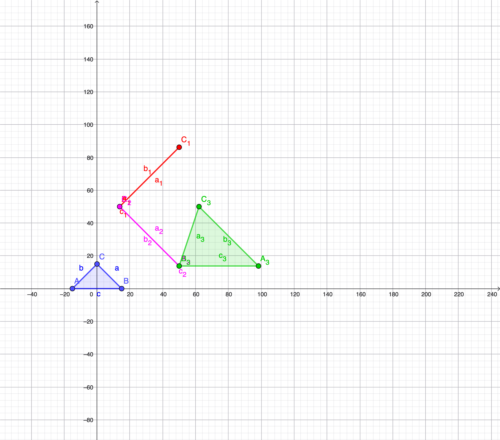

# 🎨 Computer Graphics Exercises
(SUPSI – BSc Computer Engineering 👨🏻‍💻)


> 🚧 This repository is a work in progress and will grow over time as part of my Computer Graphics learning path.

---

## 📚 Topics Covered

- Object → World transformations  
- Affine transformations (scaling, rotation, translation)
- Transformation composition
- Perspective projection
- Homogeneous coordinates
- Clip coordinates
- Normalized Device Coordinates (NDC)
- Viewport transformation
- Screen space mapping

---

## 🧩 Exercise: Transformation Pipeline

The implemented program performs the complete geometric pipeline on a triangle defined in **object coordinates**:

1. **Isotropic scaling** (factor 0.5)  
2. **Rotation** (90° around Z-axis)  
3. **Translation** (+10 units along X-axis)  
4. **Perspective projection**
   - Field of View: 45°  
   - Aspect Ratio: 1  
   - Near Plane: 1  
   - Far Plane: 100  
5. **Perspective divide**  
6. **Viewport mapping** to a **100×100 screen**

The program computes and prints:

- World coordinates  
- Clip coordinates  
- Screen coordinates  

---

## 📐 Geometric Visualization

Resulting screen-space triangles were plotted to verify correctness of the transformation pipeline.

Example visualization:



---

## 🛠 Technologies Used

- **C++17**
- **GLM (OpenGL Mathematics Library)**
- **Visual Studio 2022 Community**
- **GeoGebra** (for geometric validation)

---

## 📂 Project Structure

```
ComputerGraphics  
│  
├── Serie2  
│   ├── Serie2.cpp  
│   ├── Serie2.vcxproj  
│   ├── plot_serie2.png  
│  
├── external  
│   └── glm  
```

The GLM library is included as a local dependency to ensure **project portability**.

---

## 🎯 Learning Objectives

This exercise focuses on understanding:

- How 3D objects are transformed through the graphics pipeline  
- The importance of transformation order  
- The role of homogeneous coordinates  
- The relationship between mathematical theory and graphical representation  

---

## 👨🏻‍💻 Author

**Valentino Calonga**  
BSc Computer Engineering – SUPSI  
ICT Plant Manager | IT/OT Infrastructure & Digitalization  
